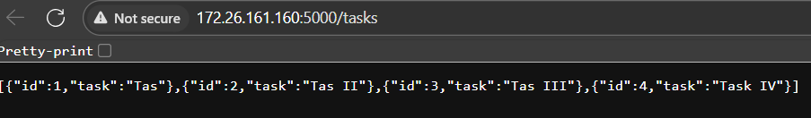

# 🧩 Evaluación Final
### Conteinerización y Orquestación de Contenedores

---

## 🎯 Objetivo general

Este proyecto demuestra la implementación de una aplicación distribuida utilizando arquitectura de microservicios, conteinerización y orquestación. La aplicación se puede desplegar mediante tres métodos diferentes:

- **Docker Compose**: Para desarrollo local y pruebas
- **Docker Swarm**: Para orquestación simple y escalabilidad básica
- **Kubernetes (K3d)**: Para orquestación completa y producción

La aplicación es un sistema de gestión de tareas (**To-Do List**) que consta de:

1. **Frontend**: Interfaz web minimalista construida con HTML y JavaScript puro
2. **Backend**: API RESTful desarrollada en Flask (Python)
3. **Base de datos**: PostgreSQL 16 para almacenamiento persistente
4. **Logger**: Servicio independiente para registro de eventos
5. **Adminer**: Interfaz de administración de base de datos

Cada componente está completamente containerizado y puede ser desplegado y escalado de forma independiente.

---

## 🏗️ Arquitectura del Sistema

El sistema implementa una arquitectura de microservicios donde cada componente tiene una responsabilidad única y bien definida:

### Componentes principales

1. **Frontend** (`nginx:alpine`)
   - Interfaz de usuario simple y ligera
   - Servido por Nginx en el puerto 80
   - Consume la API REST del backend mediante fetch
   - No requiere build complejo ni dependencias

2. **Backend** (`python:3.10-alpine`)
   - API REST en Flask con los siguientes endpoints:
     - `GET /tasks`: Lista todas las tareas
     - `POST /tasks`: Crea una nueva tarea
   - Dependencias principales:
     ```plaintext
     flask
     flask-cors
     psycopg2-binary
     requests
     ```
   - Conexión a PostgreSQL mediante variables de entorno
   - Logging asíncrono al servicio logger

3. **Base de datos** (`postgres:16-alpine`)
   - PostgreSQL 16 en su versión Alpine para menor tamaño
   - Datos persistentes mediante volumen Docker
   - Configuración mediante variables de entorno:
     - `POSTGRES_USER`
     - `POSTGRES_PASSWORD`
     - `POSTGRES_DB`

4. **Logger** (`python:3.10-alpine`)
   - Microservicio Flask dedicado al registro de eventos
   - Endpoint: `POST /log`
   - Almacena logs en volumen compartido `/logs`
   - Mínimas dependencias (solo Flask)

5. **Adminer** (`adminer:4`)
   - Interfaz web para gestión de base de datos
   - Acceso directo a PostgreSQL
   - Útil para depuración y mantenimiento

### Diagrama de arquitectura


---

## 🧰 Fase 1: Contenerización y Despliegue Local con Docker Compose

### Dockerfiles

Cada servicio tiene su propio `Dockerfile` optimizado:

1. **Frontend** (`frontend/Dockerfile`):
```dockerfile
FROM nginx:alpine
COPY index.html /usr/share/nginx/html/index.html
EXPOSE 80
```

2. **Backend** (`backend/Dockerfile`):
```dockerfile
FROM python:3.10-alpine
WORKDIR /app
COPY requirements.txt .
RUN pip install -r requirements.txt
COPY app.py .
EXPOSE 5000
CMD ["python", "app.py"]
```

3. **Logger** (`logger/Dockerfile`):
```dockerfile
FROM python:3.10-alpine
WORKDIR /app
COPY logger.py .
RUN pip install flask
VOLUME ["/logs"]
EXPOSE 4000
CMD ["python", "logger.py"]
```

### Docker Compose

El archivo `docker-compose.yml` orquesta todos los servicios:

```yaml
version: "3.9"

services:
  db:
    image: postgres:16-alpine
    container_name: todo_db
    environment:
      POSTGRES_USER: ${POSTGRES_USER}
      POSTGRES_PASSWORD: ${POSTGRES_PASSWORD}
      POSTGRES_DB: ${POSTGRES_DB}
    volumes:
      - db_data:/var/lib/postgresql/data
    networks:
      - app_net

  backend:
    build: ./backend
    container_name: todo_backend
    environment:
      - DB_HOST=db
      - POSTGRES_USER=${POSTGRES_USER}
      - POSTGRES_PASSWORD=${POSTGRES_PASSWORD}
      - POSTGRES_DB=${POSTGRES_DB}
      - LOGGER_URL=http://logger:4000/log
    depends_on:
      - db
      - logger
    ports:
      - "${BACKEND_PORT}:5000"
    networks:
      - app_net

  frontend:
    build: ./frontend
    container_name: todo_frontend
    ports:
      - "${FRONTEND_PORT}:80"
    depends_on:
      - backend
    networks:
      - app_net

  adminer:
    image: adminer:4
    container_name: todo_adminer
    ports:
      - "${ADMINER_PORT}:8080"
    depends_on:
      - db
    networks:
      - app_net

  logger:
    build: ./logger
    container_name: todo_logger
    ports:
      - "${LOGGER_PORT}:4000"
    volumes:
      - ./logs:/logs
    networks:
      - app_net

volumes:
  db_data:

networks:
  app_net:
    driver: bridge
```

### Características principales

- **Red dedicada**: `app_net` para comunicación interna segura
- **Volúmenes persistentes**: 
  - `db_data` para PostgreSQL
  - `./logs` para el servicio de logging
- **Variables de entorno**: Configuración mediante archivo `.env`
- **Dependencias**: Orden de inicio controlado con `depends_on`

### Despliegue Local

1. Crear archivo `.env` con las variables necesarias:
```env
POSTGRES_USER=todo_user
POSTGRES_PASSWORD=todo_pass
POSTGRES_DB=todo_db
FRONTEND_PORT=8080
BACKEND_PORT=5000
ADMINER_PORT=8081
LOGGER_PORT=4000
```

2. Construir y ejecutar:
```bash
docker compose up --build
```

### Servicios Disponibles

| Servicio  | URL                                    | Descripción                | Captura                    |
|-----------|----------------------------------------|----------------------------|----------------------------|
| Frontend  | [http://localhost:8080](http://localhost:8080) | Interfaz de usuario web |  |
| Backend API| [http://localhost:5000/tasks](http://localhost:5000/tasks) | API REST |  |
| Adminer   | [http://localhost:8081](http://localhost:8081) | Gestión de base de datos |  |
| Logger    | Puerto 4000 (interno)                  | Servicio de logs interno   |  |
| PostgreSQL| Puerto 5432 (interno)                  | Base de datos             |

El backend se conecta a la base de datos a través de la red interna, inicializando la tabla `tasks` al inicio.
El logger escribe mensajes cada vez que se crea una nueva tarea, demostrando comunicación inter-servicio por HTTP interno.

### Diagrama de red


---

## ⚙️ Fase 2: Orquestación con Docker Swarm

En esta etapa se transformó el `docker-compose.yml` en un `stack-deploy.yml`, compatible con Docker Swarm.

Los principales ajustes fueron:

* Inclusión de secciones `deploy` con réplicas, políticas de reinicio y límites de recursos.
* Uso de imágenes etiquetadas (`todo-app-frontend:1.0`, `todo-app-backend:1.0`, `todo-app-logger:1.0`).
* Configuración de red tipo `overlay`.
* Escalabilidad de frontend y backend a 2 réplicas.

Para trabajar con docker usamos IP eth0:

```bash
ip addr show
-> 172.26.161.160 (en mi caso)
```

Actualizamos la constante API en frontend con la IP:

```html
<!DOCTYPE html>
<html>
<head><title>To-Do List</title></head>
<body>
<h1>Mis Tareas</h1>
<ul id="task-list"></ul>
<input id="new-task" placeholder="Nueva tarea" />
<button onclick="addTask()">Agregar</button>

<script>
    const API = "http://172.26.161.160:5000/tasks";
    
    async function loadTasks() {
    const res = await fetch(API);
    const data = await res.json();
    document.getElementById('task-list').innerHTML =
        data.map(t => `<li>${t.task}</li>`).join('');
    }

    async function addTask() {
    const task = document.getElementById('new-task').value;
    await fetch(API, {
        method: 'POST',
        headers: {'Content-Type': 'application/json'},
        body: JSON.stringify({task})
    });
    loadTasks();
    }

    loadTasks();
</script>
</body>
</html>

```

El etiquetado se genera con:

```bash
docker build -t todo-app-backend:1.0 ./backend
docker build -t todo-app-frontend:1.0 ./frontend
docker build -t todo-app-logger:1.0 ./logger
```

El archivo `stack-deploy.yml` orquesta todos los servicios::

```yaml
version: "3.9"

services:
  db:
    image: postgres:16-alpine
    deploy:
      replicas: 1
      restart_policy:
        condition: on-failure
    environment:
      POSTGRES_USER: todo_user
      POSTGRES_PASSWORD: todo_pass
      POSTGRES_DB: todo_db
    volumes:
      - db_data:/var/lib/postgresql/data
    networks:
      - app_net

  backend:
    image: todo-app-backend:1.0
    build: ./backend
    deploy:
      replicas: 2
      restart_policy:
        condition: on-failure
      resources:
        limits:
          cpus: "0.5"
          memory: 256M
    environment:
      - DB_HOST=db
      - POSTGRES_USER=todo_user
      - POSTGRES_PASSWORD=todo_pass
      - POSTGRES_DB=todo_db
      - LOGGER_URL=http://logger:4000/log
    depends_on:
      - db
      - logger
    ports:
      - "5000:5000"
    networks:
      - app_net

  frontend:
    image: todo-app-frontend:1.0
    build: ./frontend
    deploy:
      replicas: 2
      restart_policy:
        condition: on-failure
    ports:
      - "8080:80"
    depends_on:
      - backend
    networks:
      - app_net

  logger:
    image: todo-app-logger:1.0
    build: ./logger
    deploy:
      replicas: 1
      restart_policy:
        condition: on-failure
    ports:
      - "4000:4000"
    volumes:
      - logs_data:/logs
    networks:
      - app_net

  adminer:
    image: adminer:4
    deploy:
      replicas: 1
      restart_policy:
        condition: on-failure
    ports:
      - "8081:8080"
    depends_on:
      - db
    networks:
      - app_net

volumes:
  db_data:
  logs_data:

networks:
  app_net:
    driver: overlay

```

El despliegue se ejecuta con:

```bash
docker swarm init --advertise-addr 172.26.161.160
docker stack deploy -c stack-deploy.yml todoapp
```

El resultado es un conjunto de servicios replicados y gestionados por Swarm, con persistencia de datos a través de volúmenes y balanceo interno automático.

```bash
docker stack services todoapp
```

Ejemplo de salida:


### Escalabilidad

Swarm permite incrementar el número de réplicas en ejecución sin modificar la configuración base:

```bash
docker service scale todoapp_backend=3
```

Swarm gestionará el nuevo contenedor automáticamente en los nodos disponibles.

### Servicios Disponibles

| Servicio  | URL                                    | Descripción                | Captura                    |
|-----------|----------------------------------------|----------------------------|----------------------------|
| Frontend  | [http://172.26.161.160:8080](http://172.26.161.160:8080) | Interfaz de usuario web |  |
| Backend API| [http://172.26.161.160:5000/tasks](http://172.26.161.160:5000/tasks) | API REST |  |
| Adminer   | [http://172.26.161.160:8081](http://172.26.161.160:8081) | Gestión de base de datos |  |
| Logger    | Puerto 4000 (interno)                  | Servicio de logs interno   |  |
| PostgreSQL| Puerto 5432 (interno)                  | Base de datos             |
---

## ☸️ Fase 3: Despliegue en Kubernetes (K3d)

### Subir imágenes a Docker Hub

1. Para iniciar sesión desde la terminal:

```bash
docker login
```
Te pedirá tu usuario y contraseña de Docker Hub.

2. Actualizamos nuevamente la constante API en frontend con localhost:

```html
<!DOCTYPE html>
<html>
<head><title>To-Do List</title></head>
<body>
<h1>Mis Tareas</h1>
<ul id="task-list"></ul>
<input id="new-task" placeholder="Nueva tarea" />
<button onclick="addTask()">Agregar</button>

<script>
    const API = "http://localhost:5000/tasks";
    
    async function loadTasks() {
    const res = await fetch(API);
    const data = await res.json();
    document.getElementById('task-list').innerHTML =
        data.map(t => `<li>${t.task}</li>`).join('');
    }

    async function addTask() {
    const task = document.getElementById('new-task').value;
    await fetch(API, {
        method: 'POST',
        headers: {'Content-Type': 'application/json'},
        body: JSON.stringify({task})
    });
    loadTasks();
    }

    loadTasks();
</script>
</body>
</html>

```

3. El etiquetado se genera con:

```bash
docker build -t rbaldiviezo/todo_backend:1.0 ./backend
docker build -t rbaldiviezo/todo_frontend:1.1 ./frontend
docker build -t rbaldiviezo/todo_logger:1.0 ./logger
```

2. Para subir imagenes a docker hub:

```bash
docker push rbaldiviezo/todo_backend:1.0
docker push rbaldiviezo/todo_frontend:1.1
docker push rbaldiviezo/todo_logger:1.0
```

### Configuración del Clúster

K3d es una distribución ligera de Kubernetes que corre sobre Docker, perfecta para desarrollo y pruebas. 

1. Crear el clúster:
```bash
k3d cluster create todo-cluster --servers 1 --agents 2 -p "8081:80@loadbalancer" -p "5000:5000@loadbalancer" -p "8080:32081@agent:0"
```

2. Verificar el clúster:
```bash
kubectl cluster-info
kubectl get nodes
```

### Manifiestos de Kubernetes

Los servicios se definen mediante archivos YAML separados:

1. **Base de Datos** (`db-deployment.yaml`):
```yaml
apiVersion: apps/v1
kind: Deployment
metadata:
  name: todo-db
  namespace: todo-app
spec:
  replicas: 1
  selector:
    matchLabels:
      app: todo-db
  template:
    metadata:
      labels:
        app: todo-db
    spec:
      containers:
        - name: postgres
          image: postgres:16-alpine
          env:
            - name: POSTGRES_USER
              value: todo_user
            - name: POSTGRES_PASSWORD
              value: todo_pass
            - name: POSTGRES_DB
              value: todo_db
          ports:
            - containerPort: 5432
          volumeMounts:
            - name: db-data
              mountPath: /var/lib/postgresql/data
      volumes:
        - name: db-data
          emptyDir: {}
---
apiVersion: v1
kind: Service
metadata:
  name: todo-db
  namespace: todo-app
spec:
  type: ClusterIP
  selector:
    app: todo-db
  ports:
    - port: 5432
      targetPort: 5432
```

2. **Backend** (`backend-deployment.yaml`):
```yaml
apiVersion: apps/v1
kind: Deployment
metadata:
  name: todo-backend
  namespace: todo-app
spec:
  replicas: 2
  selector:
    matchLabels:
      app: todo-backend
  template:
    metadata:
      labels:
        app: todo-backend
    spec:
      containers:
        - name: backend
          image: rbaldiviezo/todo_backend:1.0
          ports:
            - containerPort: 5000
          env:
            - name: DB_HOST
              value: todo-db
            - name: POSTGRES_USER
              value: todo_user
            - name: POSTGRES_PASSWORD
              value: todo_pass
            - name: POSTGRES_DB
              value: todo_db
            - name: LOGGER_URL
              value: http://todo-logger:4000/log
---
apiVersion: v1
kind: Service
metadata:
  name: todo-backend
  namespace: todo-app
spec:
  type: LoadBalancer
  selector:
    app: todo-backend
  ports:
    - name: http
      port: 5000
      targetPort: 5000
```

3. **Frontend** (`frontend-deployment.yaml`):
```yaml
apiVersion: apps/v1
kind: Deployment
metadata:
  name: todo-frontend
  namespace: todo-app
spec:
  replicas: 2
  selector:
    matchLabels:
      app: todo-frontend
  template:
    metadata:
      labels:
        app: todo-frontend
    spec:
      containers:
        - name: frontend
          image: rbaldiviezo/todo_frontend:1.1
          ports:
            - containerPort: 80
---
apiVersion: v1
kind: Service
metadata:
  name: todo-frontend
  namespace: todo-app
spec:
  type: LoadBalancer
  selector:
    app: todo-frontend
  ports:
    - name: http
      port: 80
      targetPort: 80
```

4. **Adminer** (`adminer-deployment.yaml`):
```yaml
apiVersion: apps/v1
kind: Deployment
metadata:
  name: todo-adminer
  namespace: todo-app
spec:
  replicas: 1
  selector:
    matchLabels:
      app: todo-adminer
  template:
    metadata:
      labels:
        app: todo-adminer
    spec:
      containers:
        - name: adminer
          image: adminer:4
          ports:
            - containerPort: 8080
---
apiVersion: v1
kind: Service
metadata:
  name: todo-adminer
  namespace: todo-app
spec:
  type: NodePort
  selector:
    app: todo-adminer
  ports:
    - port: 8080
      targetPort: 8080
      nodePort: 32081
```

5. **Logger** (`logger-deployment.yaml`):
```yaml
apiVersion: apps/v1
kind: Deployment
metadata:
  name: todo-logger
  namespace: todo-app
spec:
  replicas: 1
  selector:
    matchLabels:
      app: todo-logger
  template:
    metadata:
      labels:
        app: todo-logger
    spec:
      containers:
        - name: logger
          image: rbaldiviezo/todo_logger:1.0
          ports:
            - containerPort: 4000
          volumeMounts:
            - name: logs-volume
              mountPath: /logs
      volumes:
        - name: logs-volume
          emptyDir: {}
---
apiVersion: v1
kind: Service
metadata:
  name: todo-logger
  namespace: todo-app
spec:
  type: ClusterIP
  selector:
    app: todo-logger
  ports:
    - port: 4000
      targetPort: 4000
```

### Despliegue de la Aplicación

1. Crear namespace:
```bash
kubectl create namespace todo-app
```

2. Desplegar servicios:
```bash
kubectl apply -f db-deployment.yaml -n todo-app
kubectl apply -f logger-deployment.yaml -n todo-app
kubectl apply -f backend-deployment.yaml -n todo-app
kubectl apply -f frontend-deployment.yaml -n todo-app
kubectl apply -f adminer-deployment.yaml -n todo-app
```

### Estado de los Servicios

Para ver el estado actual de los servicios:

```bash
kubectl get all -n todo-app
```

Ejemplo de salida:


### Acceso a los Servicios

| Servicio  | URL                                    | Tipo          | Screenshot |
|-----------|----------------------------------------|---------------|------------|
| Frontend  | [http://localhost:8081](http://localhost:8081) | LoadBalancer |  |
| Backend   | [http://localhost:5000](http://localhost:5000) | LoadBalancer |  |
| Adminer   | [http://localhost:8080](http://localhost:8080)| NodePort | |
| Logger    | todo-logger:4000                       | ClusterIP    |    |
| Database  | todo-db:5432                           | ClusterIP    | Internal   |

### Diagrama de Kubernetes


---
